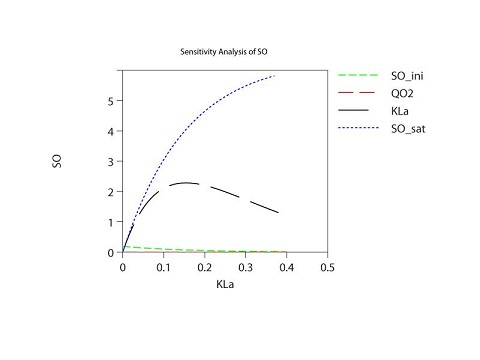
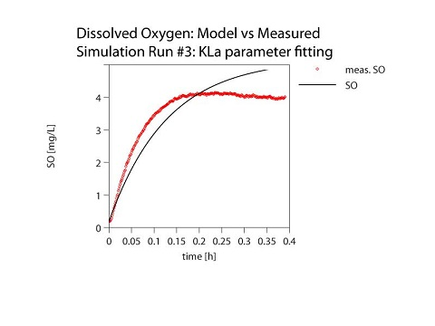

```{r setup, include=FALSE}
knitr::opts_chunk$set(echo = TRUE)
```

## Objectives
Exercise on the statement of a model, programming in AQUASIM, and devising a strategy for parameter fitting. 

Assignment is part of evaluation of Modelling Sanitation Systems Online course. 

````{r dataset, fig.width = 6, fig.height = 3,  fig.fullwidth = TRUE, fig.cap = "Endogenous respiration- phase I", warning=FALSE, cache=TRUE, echo=FALSE}
library(ggplot2)
library(readxl)
wd <- getwd()
wd <- gsub("/","\\\\", wd)
filepath <- paste(wd,"\\","Data.xls", sep="")
dataset <- read_excel(filepath, sheet = "Data_all_and_calcul (2)", skip = 5)
dataset$time_hh <- as.numeric(dataset$time_hhmmss - as.POSIXct("1899-12-31 14:51:40 UTC"))/60
ggplot(dataset, aes(time_hh,doc_mgl,fill=phase))+geom_line(aes(colour=phase, group=phase))
```

## Procedure

- First, oxygen uptake rate is obtained from data by fitting a linear model to data in phase I 
```{r OUR2, fig.width = 8, fig.height = 4,  fig.fullwidth = TRUE, fig.cap = "QO2 estimation- Phase 1 data", warning=FALSE, cache=TRUE,echo=FALSE}
library(readxl)
library(lattice)
wd <- getwd()
wd <- gsub("/","\\\\", wd)
filepath <- paste(wd,"\\","Data.xls", sep="")
dataset <- read_excel(filepath, sheet = "Data_all_and_calcul (2)", skip = 5)
dataset$time_hh <- as.numeric(dataset$time_hhmmss - as.POSIXct("1899-12-31 14:51:40 UTC"))/60
p1_dataset <- subset(dataset,dataset$phase==1)
OUR_lm <- lm(doc_mgl ~ time_hh, data = p1_dataset)
# print(OUR_lm)

tp <- sprintf("%s=%.1f + %.3f %s, r2=%.4f", all.vars(formula(OUR_lm))[1],
  coef(OUR_lm)[1], coef(OUR_lm)[2], all.vars(formula(OUR_lm))[2], summary(OUR_lm)$r.squared)

mypanel<-function(x,y,...){
  panel.xyplot(x, y, ...)
  panel.abline(OUR_lm)
  panel.text(0.3,4,labels=tp)
}
xyplot(doc_mgl ~ time_hh, data = p1_dataset, panel = mypanel)
print(paste("QO2 = ", as.character(round(OUR_lm$coefficients[2],3))," [mg/L-h]", ""))
```

- Second, initial condition for SO (SO_ini) for AQUASIM simulation is read from data at phase II, by retrieving the minimum value in phase II.
```{r SO_ini, cache= TRUE, warning=FALSE, echo=FALSE}
library(readxl)
wd <- getwd()
wd <- gsub("/","\\\\", wd)
filepath <- paste(wd,"\\","Data.xls", sep="")
dataset <- read_excel(filepath, sheet = "Data_all_and_calcul (2)", skip = 5)
p2_dataset <- subset(dataset,dataset$phase==2)
SO_ini <- min(p2_dataset$doc_mgl)
print(paste("SO_ini = ", as.character(SO_ini)," [mg/L]", sep = ""))
```
- Third, dissolved Oxygen concentration at equilibrium is read from data in phase II as the maximum value:
```{r SO_eq, warning=FALSE, echo= FALSE}
library(readxl)
wd <- getwd()
wd <- gsub("/","\\\\", wd)
filepath <- paste(wd,"\\","Data.xls", sep="")
dataset <- read_excel(filepath, sheet = "Data_all_and_calcul (2)", skip = 5)
p2_dataset <- subset(dataset,dataset$phase==2)
SO_eq <- max(p2_dataset$doc_mgl)
print(paste("SO_eq = ", as.character(SO_eq)," [mg/L]", sep = ""))

```
- Fourth, we obtained SO_sat from data in phase III, when SO reached its maximum
```{r SO_sat, warning=FALSE, echo=FALSE}
library(readxl)
wd <- getwd()
wd <- gsub("/","\\\\", wd)
filepath <- paste(wd,"\\","Data.xls", sep="")
dataset <- read_excel(filepath, sheet = "Data_all_and_calcul (2)", skip = 5)
p3_dataset <- subset(dataset,dataset$phase==3)
SO_sat <- max(p3_dataset$doc_mgl)
print(paste("SO_sat = ", as.character(SO_sat)," [mg/L]", sep = ""))

```

As substrate is depleted, Biomass undergoes endogenous respiration process in phase 1. As stated in problem definition, OUR is constant.

As $\frac{dSO}{dt} = KLa*(SO_{sat} - SO) - Q2O*SO$, at equilibrium $\frac{dSO}{dt} = 0$, hence $KLa = \frac {Q2O}{SO_{sat} - SO_{eq}}$

```{r Kla, warning=FALSE, echo=FALSE }
print(paste("KLa = ",as.character(round(20.376/(5.6198-4.14821),3))," [1/h]"))
```

**Simulation with AQUASIM**

State variable are dissolved oxygen concentration in liquid phase(SO) and oxygen concentration in gas phase, both in [mg/L]. Process variable is time in [h].

Process are defined as two reactions: 

$K_{La}*(SO_sat - SO)$ for oxygen mass transfer during airation, 

and $-QO2*SO$ for endogenous respiration (decay). 

Biomass Heterotrophic growth is not considered as substrate is depleted. For airation, KLa and SO_sat are set to be 13,846 [1/h] and 5,6198 [mg/L], from calculations mentioned above. Reactor volumen is set to be 1,64 [L]. Petersen matrix is shown below:


```{r petersen, echo=FALSE, warning= FALSE}
            # c("Component","XH", "XI", "SO", "SG")
library("knitr")
petersen <- data.frame(process=rep(NA,2),  SO=rep(NA,2), Expr=rep(NA,2))
airation <- c("Airation", 1,"KLa*(SO_sat - SO)")
decay <-    c("Decay",-1,"QO2" )
petersen[1,] <- airation
petersen[2,] <- decay
knitr::kable(
  petersen, caption = 'Petersen matrix.')
```

For endogenous respiration (decay) process's reaction rate, QO2 was estimated above.

A compartment is defined as a CSRT with airation and decay process activated. An inflow of air to compartment with no water flow but gas with O2 concentration (SG) equal to 203 [mg/L]. SG is calculated using the Ideal gas law: $SG = PO/RT$ at with appropriate units. 

Neither diffusive nor adventive link are considered.

Simulation time interval simulation was set to be 0.001 [h] ranging and 400 steps.

##Sensitivity Analysis##
Sensitivity analysis was done for SO_sat, QO2, SO_ini, and KLa. SO showed to increase as SO_sat increases and decreased as KLa increased. A changein QO2 and SO_ini don't change SO as the other parameters do. Plot at the left and side shows the sensitivity analysis before  and after parameter estimation, respectively.



##Model parameters adjustment##

The strategy is fitting SO_sat and KLa, simultaneouly. Results are shown in Table 2.



```{r AQUASIM resuts, echo=FALSE, warning= FALSE}
parameters <- data.frame(parameter=rep(NA,2), Initial_Estimation=rep(NA,2) , Fitted_Value=rep(NA,4), ChiSqr=rep(NA,4))
SO_ini <- c("SO_ini [mg/L]", "0,189951", "0,189951", NA)
QO2 <- c("Q2O [mg/L-h]", "-20,376447", "-20,376447", NA)
SO_sat <- c("SO_sat [mg/L]", "5,6198", "4,1992", "5,0473533")
KLa <- c("KLa [1/h]", "13,846", "15,000", "5,0473533")
parameters[1,] <- SO_ini
parameters[2,] <- QO2
parameters[3,] <- SO_sat
parameters[4,] <- KLa
knitr::kable(
  parameters, caption = 'Parameter fitting with AQUASIM.')
```

Simulation file can be found at the following link: Dropbox (https://www.dropbox.com/s/jt96iv8p5yep26w/oxygen-mass-transfer-sensitivity-analysis-2.lis?dl=0)