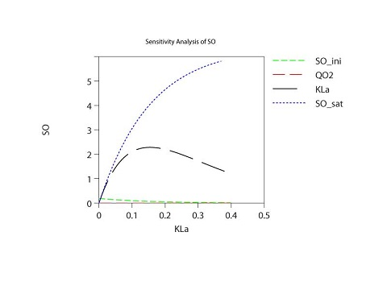

```{r setup, include=FALSE}
knitr::opts_chunk$set(echo = TRUE)
```

## Objectives
Exercise on the statement of a model, programming in AQUASIM, and devising a strategy for parameter fitting. 

Assignment is part of evaluation of Modelling Sanitation Systems Online course. 

````{r dataset, fig.width = 4, fig.height = 2,  fig.fullwidth = TRUE, fig.cap = "Endogenous respiration- phase I", warning=FALSE, cache=TRUE, echo=FALSE}
library(ggplot2)
library(readxl)
wd <- getwd()
wd <- gsub("/","\\\\", wd)
filepath <- paste(wd,"\\","Data.xls", sep="")
dataset <- read_excel(filepath, sheet = "Data_all_and_calcul (2)", skip = 5)
ggplot(dataset, aes(time_hhmmss,doc_mgl,fill=phase))+geom_line(aes(colour=phase, group=phase))
```

## Procedure

Dissolved Oxygen concentration at equilibrium will be calculated using the Henry's Law. For that purpose:
first, determine the barometrice pressure at 2600 [m], given P0, T, R, g, M using the barometric formula:

(@) $P=P0*e^\frac{-Mgz}{RT}$
where:

$M=1,785*10^20$ [mol]; $P0=101325$ [Pa]; $T=298,15$ [K]; $R=3,314$ [J*K/mol]; $g=9,80$ [m/s^2]

$P = 101325*exp(-\frac{28,96*10^-3*9,8*2600}{8,314*298,15}) = 75214$ [Pa]

Second, determine dissolve oxygen concentration:

$SO_eq = \frac {P}{K_{H}}$

where $P= 75214$ [Pa]

$K_{H} = 78,020*10^3$ [Pa*L/mol] ^[Sanders, R (2015), "Compilation of Henry's Law constants for water as a solvent". Atmos. Chem. Phys 15: 4399-4981]

Partial pressure for oxygen is $P_{O2}=0,21*P = 15795$ [Pa]

$SO_eq = \frac {15795*32*1000}{78,020*10^3} = 6.4$ [mg/L]

As substrate is depleted, Biomass undergoes endogenous respiration process in phase 1. As stated in problem definition, OUR is constant.

Alternatively, $OUR$ can be obtained from linear regression of dissolved oxygen vs time

```{r OUR2, fig.width = 4, fig.height = 2,  fig.fullwidth = TRUE, fig.cap = "QO2 estimation- Phase 1 data", warning=FALSE, cache=TRUE,echo=FALSE}
library(readxl)
library(lattice)
wd <- getwd()
wd <- gsub("/","\\\\", wd)
filepath <- paste(wd,"\\","Data.xls", sep="")
dataset <- read_excel(filepath, sheet = "Data_all_and_calcul (2)", skip = 5)
p1_dataset <- subset(dataset,dataset$phase==1)
p1_dataset$time_hh <- as.numeric(p1_dataset$time_hhmmss- as.POSIXct("1899-12-31 14:51:40"))/60
OUR_lm <- lm(doc_mgl ~ time_hh, data = p1_dataset)
# print(OUR_lm)
xyplot(doc_mgl ~ time_hh, data = p1_dataset, panel = function(x, y, ...) {
                 panel.xyplot(x, y, ...)
                 panel.lmline(x, y, ...)
               })
print(paste("OUR_OHO = ", as.character(OUR_lm$coefficients[2])," [mg/L-h]", ""))
```
$K_{La}$ can obtained directly without need to use AQUASIM, by plotting linear solution of ODE $ln(\frac{SO_{eq}-SO}{SO_{eq}-SO_{0}})$ vs time plus linear regression to obtain the linear slope coefficient as $K_{La}$ with the assumption reactor is modelled as CSTR, as per Tourlousse and Ahmad^[http://www.egr.msu.edu/~hashsham/courses/ene806/docs/Oxygen%20Uptake%20Rate].

```{r Kal, fig.width = 4, fig.height = 2,  fig.fullwidth = TRUE, fig.cap = "KLa as slope of linearized ODE solution vs time ", warning=FALSE, cache=TRUE, echo=FALSE }
library(lattice)
library(readxl)
wd <- getwd()
wd <- gsub("/","\\\\", wd)
filepath <- paste(wd,"\\","Data.xls", sep="")
dataset <- read_excel(filepath, sheet = "Data_all_and_calcul (2)", skip = 5)
p2_dataset <- subset(dataset,dataset$phase==2)
p2_dataset$time_hh <- as.numeric(p2_dataset$time_hhmmss- as.POSIXct("1899-12-31 14:51:40"))/60-0.3877778
# print(p2_dataset$time_hh[nrow(p2_dataset)])
p2_dataset$LN <- log((6.4-p2_dataset$doc_mgl)/(6.4-p2_dataset$doc_mgl[1]))
p2_dataset_lm <- subset(p2_dataset, p2_dataset$time_hh < 0.15)
Kla_lm <- lm(LN ~ time_hh, data = p2_dataset_lm)
# print(Kla_lm)
xyplot(LN ~ time_hh, data = p2_dataset_lm, panel = function(x, y, ...) {
                 panel.xyplot(x, y, ...)
                 panel.lmline(x, y, ...)
               })
print(paste("KLa = ", as.character(round(Kla_lm$coefficients[2],3))," [1/h]", ""))
```
**Simulation with AQUASIM**

State variable are dissolved oxygen concentration in liquid phase(SO) and oxygen concentration in gas phase, both in [mg/L]. Process variable is time in [h].

Process are defined as two reactions: 

$K_{La}*(SO_sat - SO)$ for oxygen mass transfer during airation, 

and $b_XH*X_H$ for endogenous respiration (decay). 

Biomass Heterotrophic growth is not considered as substrate is depleted. For airation, KLa and SO_sat are set to be 6.479 [1/h] and 6.4 [mg/L], from calculations mentioned above. Reactor volumen is set to be 1,64 [L]. Petersen matrix is shown below:


```{r petersen, echo=FALSE, warning= FALSE}
            # c("Component","XH", "XI", "SO", "SG")
library("knitr")
petersen <- data.frame(process=rep(NA,2), XH=rep(NA,2) , XI=rep(NA,2), SO=rep(NA,2), SG=rep(NA,2))
airation <- c("Airation", 0, 0, 1,-1)
decay <-    c("Decay",-1,1,-1,0 )
petersen[1,] <- airation
petersen[2,] <- decay
knitr::kable(
  petersen, caption = 'Table 1. Petersen matrix.')
```

For endogenous respiration (decay) process's reaction rate, b_XH was se to 0.233 [1/h]. As QO2 is constant, initial Biomass concentration XH_0 was estimated by dividing OUR by b_XH: XH_0 = 85 [mg/L].

A compartment is defined as a CSRT with airation and decay process activated. An inflow of air to compartment with no water flow but gas with O2 concentration (SG) equal to 203 [mg/L]. SG is calculated using the Ideal gas law: $SG = PO/RT$ at with appropriate units. 

Neither diffusive nor adventive link are considered.

Simulation time interval simulation was set to be 0.001 [h] ranging and 400 steps.

##Sensitivity Analysis##
Sensitivity analysis was done for SO_sat, QO2, SO_ini, and KLa. SO showed to increase as SO_sat increases and decreased as KLa increased. A changein QO2 and SO_ini don't change SO as the other parameters did.



##Model parameters adjustment##
The strategy is fitting SO_sat and KLa

First, SO was fitted to data by changing SO_sat. SO_sat was set to 5,174 [mg/L] with standard error o,o5.

Second, SO predicted was fitted measured SO by changing KLa. parameter value was set to 7,768 [1/h] with standard error of 0,177.


